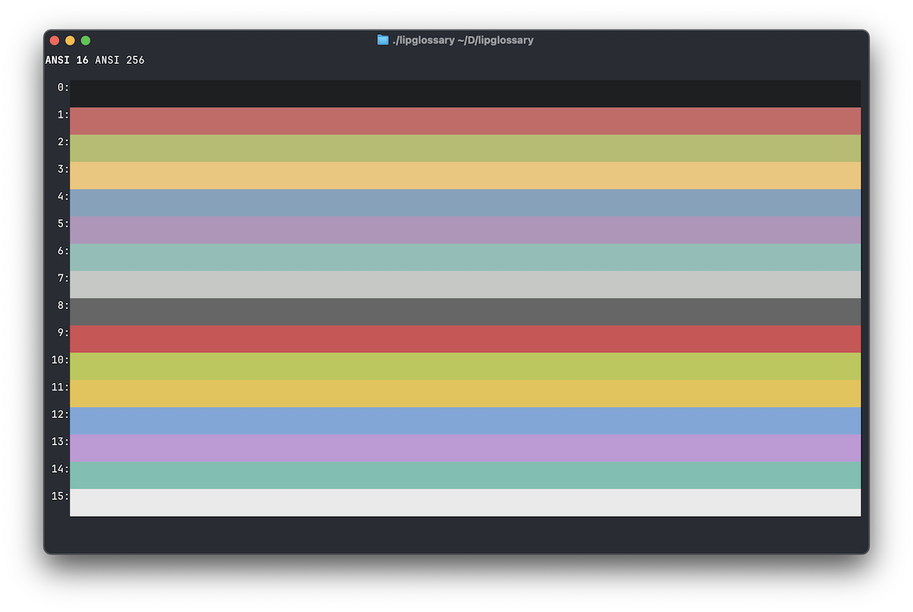
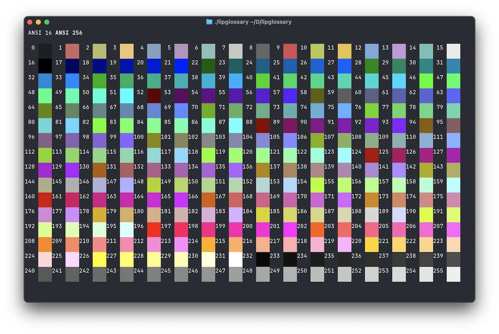

# Lip Glossary

Display [Lip Gloss](https://github.com/charmbracelet/lipgloss) ANSI colors in your terminal.

## Usage

`go run .` or build and run `./lipglossary`

- `h` and `l` to switch between ANSI 16 and ANSI 256 tabs
- `q` to quit

