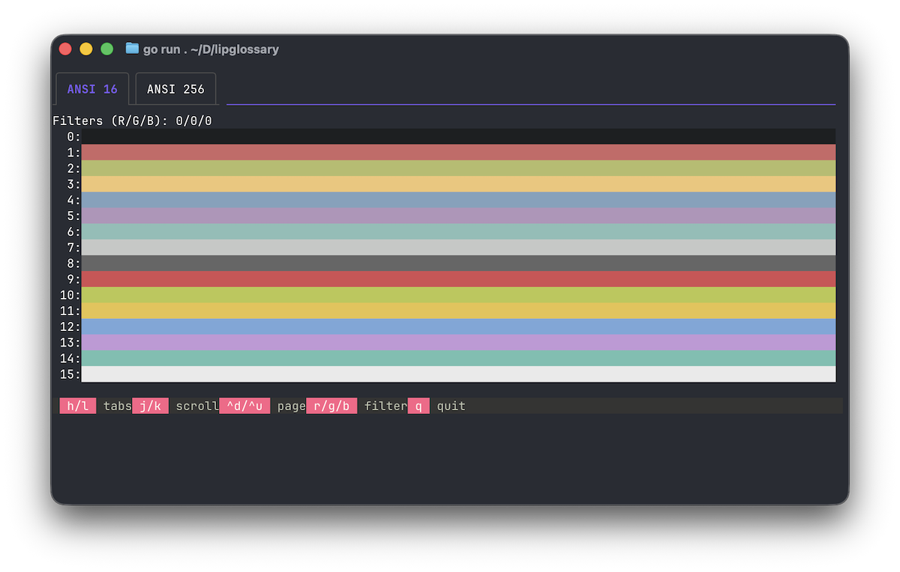
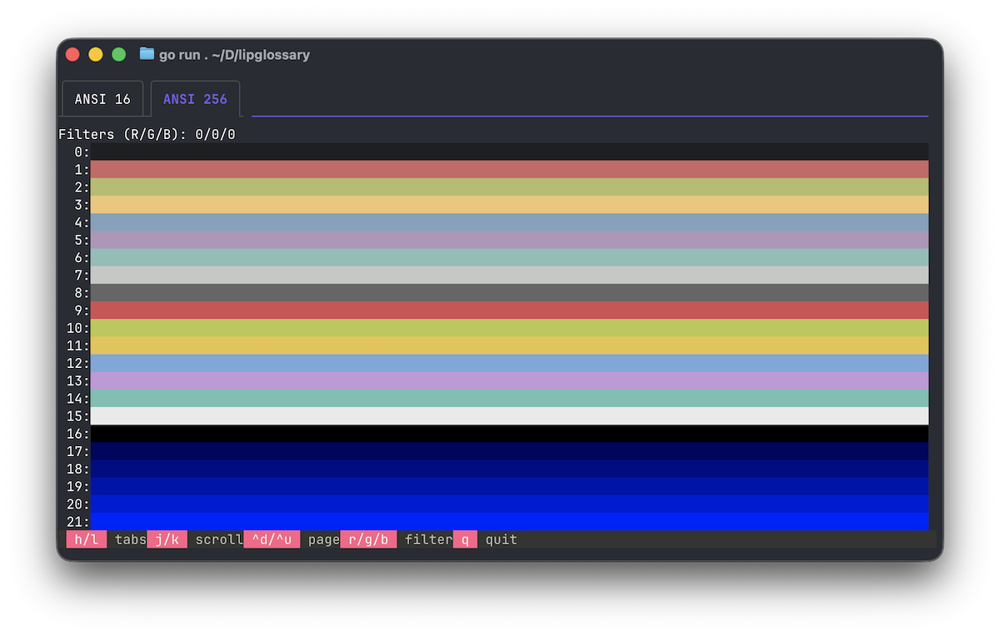
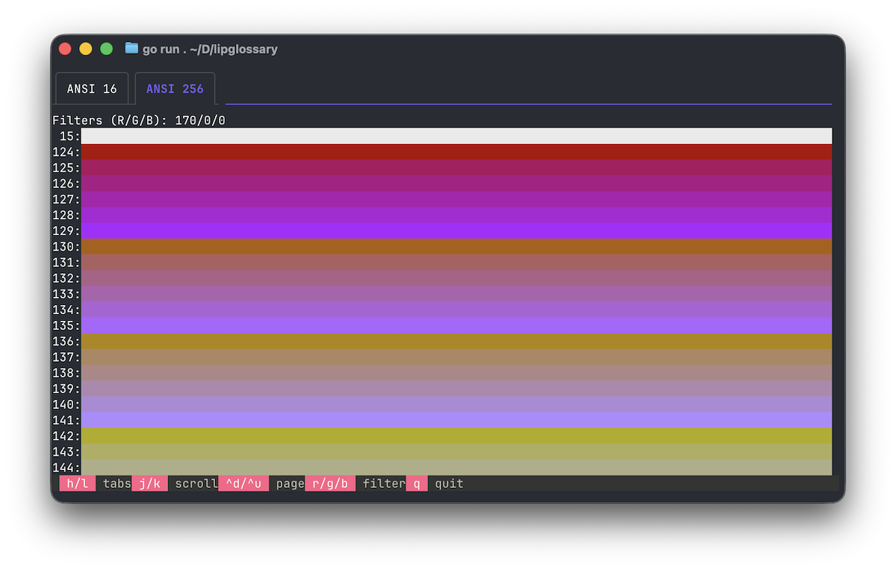

# Lip Glossary

Display [Lip Gloss](https://github.com/charmbracelet/lipgloss) ANSI colors in your terminal.

## Usage

`go run .` or build and run `./lipglossary`

- `h` and `l` to switch between ANSI 16 and ANSI 256 tabs
- `j` and `k` to scroll viewport
- `^d` and `^u` to page viewport
- `r` and `R` to increase/decrease red threshold
- `g` and `G` to increase/decrease green threshold
- `b` and `B` to increase/decrease blue threshold
- `q` to quit

